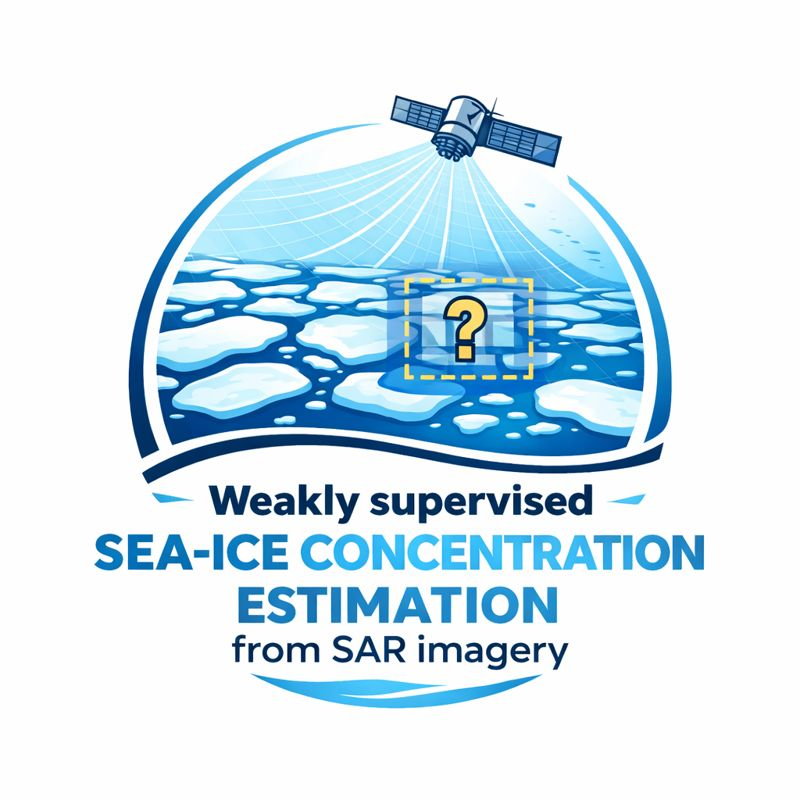

# AI4Arctic Sea Ice

  

## Présentation

Ce dépôt explore l’**estimation de la concentration de glace de mer** à partir d’**images SAR Sentinel-1**, en s’appuyant sur le jeu de données **AI4Arctic**.  
Le projet traite un problème d’**apprentissage faiblement supervisé**, où les annotations de glace sont définies au niveau des polygones (patchs) et non au niveau des pixels.

## Données

- **Jeu de données** : AI4Arctic (Institut Météorologique Danois / Université Technique du Danemark)
- **Entrées** :
  - Images SAR Sentinel-1 (polarisations HH et HV)
- **Annotations** :
  - Polygones de cartes de glace (codes SIGRID3)
  - Concentration de glace et attributs de type de glace

## Objectif

L’objectif est d’inférer des **informations de glace de mer au niveau pixel** à partir d’**annotations définies au niveau des patchs**, afin de mieux caractériser la distribution spatiale de la glace et de l’eau à haute résolution.

## Méthodes

- Modèles d’apprentissage profond (réseaux de neurones convolutifs)
- Stratégie d’entraînement par patchs
- Segmentation sémantique faiblement supervisée

## Contexte académique

Ce projet est réalisé dans le cadre d’un **travail pratique de Vision par Apprentissage Profond** au sein du  
**Mastère Spécialisé Intelligence Artificielle Multimodale**,  
Télécom Paris.

## Auteurs

- Julien Gimenez  
- Reda Elwaradi  
- Mehdi Ait Hamma  
- Stephane Hordoir  

## Statut

Travail en cours
