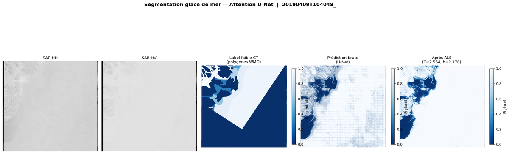

# Attention U-Net — Sea Ice Segmentation (Weakly Supervised)

---

## Overview

This folder contains an **Attention U-Net** implementation for **weakly supervised sea ice concentration mapping** from Sentinel-1 SAR imagery.

The key challenge: annotations are only available at the **polygon level** (large WMO ice-chart polygons with a single concentration value CT ∈ [0,1]), not at the pixel level. We train a pixel-wise segmentation model using only these coarse polygon-level labels.

**Key contributions :**
- **Attention U-Net** instead of plain U-Net (spatial attention gates on skip connections)
- **Polygon-level MSE loss** — true weak supervision (not patch-averaged)
- **Entropy regularization** — encourages binary (ice/water) predictions
- **Robust ALS** — clipping logits ±15 before Analytical Logit Scaling

---

## Architecture

```
Input [4, 256, 256]   (SAR HH, SAR HV, incidence angle, AMSR-2)
      │
  Encoder (4 levels: 64→128→256→512 channels)
      │    └─ MaxPool 2× at each level
      │
  Bottleneck (1024 channels)
      │
  Decoder (4 levels with Attention Gates)
      │
Output [1, 256, 256]  (logit per pixel)
```

**Total parameters:** 31.4M

---

## Results

Evaluated on **6 unseen validation scenes (2019)** — strict temporal split (train=2018, val=2019):

| Scene | Season | MAE | Accuracy ±10% |
|-------|--------|:---:|:---:|
| January 2019 | Winter | 0.092 | **72.7%** |
| March 2019 (A) | Winter | 0.205 | 40.0% |
| March 2019 (B) | Winter | 0.219 | 50.0% |
| April 2019 (A) | Spring | 0.161 | 55.0% |
| April 2019 (B) | Spring | 0.108 | **66.7%** |
| May 2019 | Spring | 0.216 | 55.6% |
| **Average** | — | **0.167** | **57.0%** |


**Inference example (April 2019):**



*Left to right: SAR HH, SAR HV, Weak label (WMO polygon CT), Raw U-Net prediction, After Analytical Logit Scaling (T=2.56, b=2.18)*

---

## Files

| File | Description |
|------|-------------|
| `config.py` | All hyperparameters, paths, ALS settings |
| `dataset.py` | PyTorch Dataset — patches 256×256, SIGRID-3 polygon parsing |
| `model.py` | Attention U-Net (31.4M params, 4 encoder levels) |
| `losses.py` | Polygon-level MSE + entropy regularization |
| `train.py` | Training loop (BF16 AMP, cosine warmup, checkpointing) |
| `inference.py` | Full scene inference (sliding window + ALS + figures) |
| `requirements.txt` | Python dependencies |

---

## Citation / References

- Oktay et al., *Attention U-Net: Learning Where to Look for the Pancreas*, MIDL 2018
- AI4Arctic dataset
